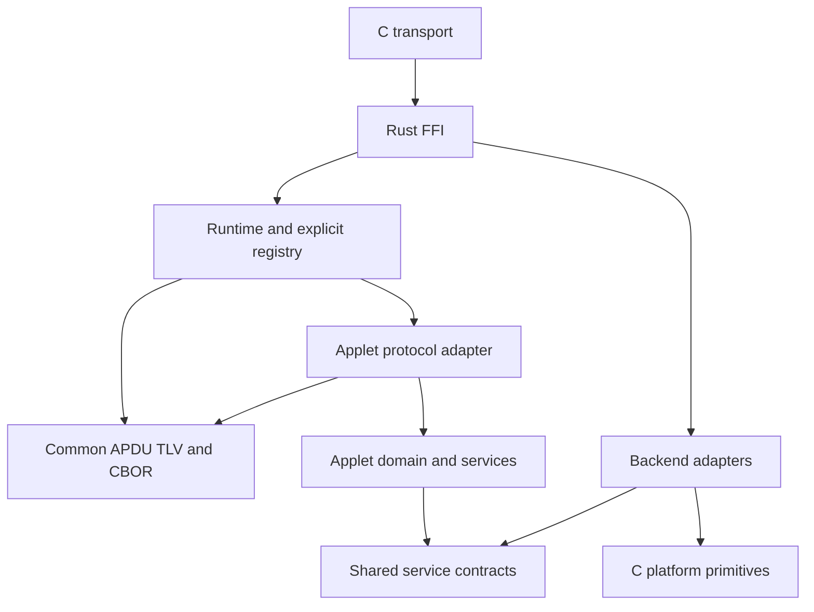
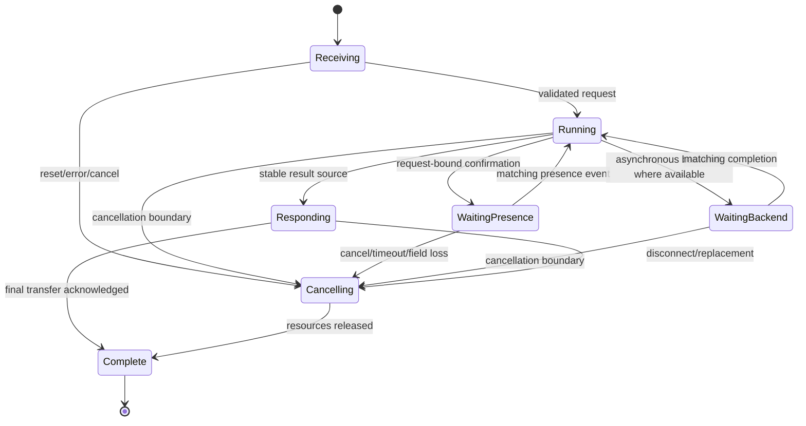

<!-- SPDX-License-Identifier: Apache-2.0 -->
# Full Rust core migration: module boundaries and service contracts

Status: migration architecture and implementation ledger, updated 2026-09-22.
The independent zero-applet USB target and the first ADMIN + PASS checkpoint
are implemented. OATH now has an APDU-free domain, a common-APDU adapter,
concrete storage, USB integration and normal host/device validation.
Design coverage for the remaining applets is not feature support.
See [ADMIN/PASS checkpoint](admin-pass.md) for its supported commands and gaps.

Scope: the complete current core, including ADMIN, PASS, OATH, CTAP2/U2F, PIV,
OpenPGP and NDEF, over USB CCID, WebUSB, CTAPHID, keyboard HID and NFC as
applicable. NFC is a transport; NDEF is an applet. CIU changes stay limited to
interfaces/backends; startup, vectors and recovery remain C. NFCC is deferred.

### Migration compatibility rule

This is an implementation-language rewrite, not a product-policy redesign.
Preserve existing AIDs, commands, data formats on the wire, authentication,
defaults, retry rules, algorithms and counter order unless the user explicitly
approves a behavioral change. Internal layout changes must be documented and
must not silently reinterpret legacy records. No unsolicited KDF, PIN hashing,
salt, enrollment protocol or extra presence requirement may be introduced.
ADMIN retains default PIN `123456` and three retries, with the C comparison and
retry-update behavior. The mistakenly introduced PBKDF2 experiment was removed.

Incomplete commands remain tracked work, not approved feature removals. In
particular, Rust ADMIN is not complete merely because PASS management works.
Other applets stay absent from the selected build until explicitly introduced.
Normal functional tests and build/link/boot checks are the verification scope;
no boundary, differential or fuzz campaign is added implicitly.

## 1. Responsibility model

| Module | Owns | Does not own |
| --- | --- | --- |
| C transport interfaces | USB enumeration, CCID/WebUSB/CTAPHID/NFC framing, endpoint buffers, link timers and transfer completion; keyboard HID encoding/report sequencing | APDU parsing, SELECT, authentication, slot selection, OTP calculation |
| Rust FFI boundary | Pointer/length validation, serialized access to the root runtime, C error conversion, alias-safe borrows | INS dispatch, credential policy, persistent record interpretation |
| Common protocol | APDU syntax/chains/response planning; bounded TLV and CBOR structural decoding/encoding | AIDs, CTAP command schemas, credential limits, storage, transport arbitration |
| Rust runtime | Transport-independent operation ownership, APDU selection, progress/cancel/presence events, resource leases and cleanup | PASS slot rules, PIN comparison algorithm, filesystem record layouts |
| Applet registry | Explicit build-time applet set, AID/native-protocol binding, delegation to typed applet adapters | Protocol parsing algorithms, implicit installation of other applets |
| Applet protocol adapter | APDU INS/P1/P2, CTAP commands and schema interpretation, semantic fields, protocol error/status mapping | USB details, common APDU parsing, crypto implementation |
| Applet domain/service | Slot/credential/key/object rules, authorization requirements, application-specific commit order, semantic results | APDU structs/SW, raw C pointers, USB packets, native struct persistence |
| Shared services | Authentication mechanisms, opaque storage contracts, crypto capabilities, secret-memory utilities, common input/output types | Applet wire commands, global authorization for unrelated applets |
| Platform backends | Filesystem operations, flash I/O, primitive crypto, RNG, touch sensing, USB report transmission | Applet record schemas, PIN retry policy, first-use enrollment policy |

C remains the transport/platform boundary. Existing C LittleFS and primitive
crypto implementations can remain backend dependencies during this rewrite.
They are explicit low-level dependencies, not permission to link C ADMIN, PIN,
PASS, OATH, `src/device.c`, `src/apdu.c`, or applet installation routines.

Logical module boundaries do not require one crate per row. Start with modules
inside the existing crates; split a crate only when dependency enforcement or
reuse justifies it. No dynamic applet registration, heap-backed registry,
general event framework, or async executor is required.

## 2. Dependency direction and assembly



Arrows express source dependencies/calls to abstractions. The assembly root
provides backend implementations to services; an applet never imports an FFI
adapter. The common protocol layer cannot depend on an applet. Shared services
cannot depend on applet implementations or emit APDU, CTAP or transport status codes.

APDU and native CTAP are separate entry paths into the same runtime. Native
CTAPHID CBOR must not be wrapped in a fabricated APDU to fit an APDU-only engine.
A FIDO APDU adapter and a CTAPHID CBOR adapter converge on typed FIDO operations;
U2F retains its own message schema. Shared logic does not imply identical wire
responses or authorization assumptions across transports.

A build-time enum/explicit match assembles enabled applets. The runtime asks
that registry for selection, request limits, command consumers and response
sources. It must not contain PASS-specific constants, direct PASS response calls,
slot indices or algorithms. A zero-applet registry is a real empty build. The ADMIN + PASS profile
must not link OATH, and applet count describes compiled applets, not
services such as PIN verification.

Proposed organization (logical, not a request to create every file now):

```text
rust/
  protocol/                  # common APDU/TLV; optional bounded CBOR primitives
  core/src/
    runtime/                 # session, command/response lifecycle, event dispatch
    registry.rs              # explicit feature-gated applet assembly
    services/                # typed storage/crypto/auth/input/output contracts
    interface/               # unsafe C ABI and platform backend adapters
    admin.rs                 # ADMIN adapter; owns PASS management commands
    pass_protocol.rs         # ADMIN PASS configuration schema
    pass.rs                  # typed PASS persistence/output service
    oath_protocol.rs         # OATH schema and SW mapping, common APDU types
  pass/src/
    domain.rs                # typed slots and calculations
    codec.rs                 # versioned record bytes, no native layout
  oath/src/                  # no APDU dependency
    credential.rs            # types and credential validation
    codec.rs                 # explicit internal record encoding
    service.rs               # repository, naming, counters and OTP calculation
    auth.rs                  # OATH access-code mechanism, not ADMIN PIN
  fido/                      # CTAP2/U2F adapters, credentials, PIN/UV, extensions
  piv/                       # PIV protocol, objects and key policy
  openpgp/                   # OpenPGP protocol, data objects and key policy
  ndef/                      # Type 4 Tag application/file semantics
  management/                # explicit optional device-management applet
interfaces/rust-core/        # C transport adapters and public ABI header
```

Applet adapters under `core/src/` may use shared `Header` and `StatusWord`;
they must not duplicate APDU definitions. `pass/` and `oath/` contain typed
records and services without a dependency on `protocol/`, core or USB. Their
crate roots expose modules/types; they do not contain transport entrypoints.

## 3. State and lifetime ownership

| State | Single owner | Lifetime/end condition |
| --- | --- | --- |
| CCID receive/transmit packet buffers | C transport | Endpoint transfer; RX borrow ends before reuse |
| Operation owner `(transport, connection/channel, generation, operation)` | Rust runtime | Operation release, reset, cancellation or validated handoff |
| Idle transport/channel bookkeeping | C transport | Link/channel expiry; does not own applet scratch |
| Selected applet | Runtime | SELECT/reset; registry identifies the target |
| Command header/chain metadata | Runtime using common protocol | Command completion, abort, replacement or reset |
| Parsed command fields and TLV decoder | Selected applet command state | Final fragment/abort; secret fields wiped |
| Response cursor and source lease | Runtime | Completion, replacement, read failure or reset |
| Response backing data | Applet/repository leased by runtime | Immutable until lease closes |
| Persistent credential/slot records | Rust repository/codec over storage backend | Explicit successful durable update |
| PIN retries | Authentication service over credential repository | Durable protocol-specific attempt/reset policy; no grant on uncertain persistence |
| Session-local grants | Runtime session context with applet policy | Reset/owner change/logout/change/deselect as specified for that grant |
| CTAP token/challenge state | Typed authentication mechanism under runtime lifecycle | Protocol-defined permissions, expiry and invalidation; not a global PIN boolean |
| Multi-command continuation (assertion enumeration, key agreement, file update) | Applet operation context leased by runtime | Explicit continuation completion/abort; never confused with response pagination |
| Pending keyboard output and output policy | Rust output job | Completion, cancellation or disconnect |
| Current HID report in flight | C HID transport | Transfer acknowledgement or endpoint teardown |

Persistent state is not erased by ordinary session cleanup. Loading/validation
is distinct from recovery: `boot/load` must never format a filesystem or treat
a corrupt record as an empty configuration. The ADMIN compatibility profile
explicitly initializes an absent new PIN record to `123456`, matching C ADMIN.

Only the main loop calls Rust or platform callbacks that might enter services.
Interrupts record transport/input events. A USB reset must not release a buffer
still borrowed by Rust; it queues cleanup and invalidates the generation. The
current CCID adapter follows this arrangement. No callback may reenter Rust.

Physical events, native CTAP requests and APDUs share one scheduler. A touch
requested by the active operation is delivered to that operation; it cannot
also trigger PASS typing. An unsolicited PASS trigger must not bypass another
operation's resource lease. The current profile rejects APDUs with 6985 while keyboard output drains, and
discards PASS gestures during APDU chains/pending responses. A future shared
Busy indicator must require another touch
rather than queue an unbounded or stale secret-output request. HID completion only advances
an existing output job. Wall-clock time is supplied by the platform; the runtime
owns operation deadlines and timeout-triggered cleanup. C interfaces own link
fragment/retry/WTX timing within an armed transport lease; they cannot extend
credential grants or decide to resume/cancel a business operation.

## 4. APDU command and response lifecycle

Conceptual lifecycle; concrete Rust traits/borrowing should follow this design,
not force a self-referential struct or one permanent large buffer per applet:

1. Transport supplies a bounded frame or, later, a bounded frame fragment.
2. Runtime establishes owner/generation, applies the transport profile and uses
   the common APDU decoder. The current device profile remains short APDUs plus
   ISO command chaining; extended transport admission is a separate capability.
3. SELECT-by-AID uses the registry. Deselect closes the previous response, aborts
   its command and revokes selection-bound grants, including when selection
   fails. Applet-local SELECT FILE (notably NDEF/OpenPGP) goes to that applet;
   not every INS A4 changes the selected application. Same-AID reselection and
   logical-channel support are explicit protocol-profile choices.
4. The selected adapter validates the command header and starts a typed command
   consumer. Runtime checks chain consistency and enforces the declared budget.
5. `feed` consumes ephemeral bytes into bounded semantic fields, a TLV consumer
   or a specifically authorized storage stream. It never retains transport slices.
6. `finish` validates the request and starts or completes a typed operation.
   Retrying PIN checks, HOTP reservation and other commit points follow explicit
   operation policy. A long operation advances through the runtime lifecycle
   below; the adapter eventually maps its typed result to SW and response data.
7. Runtime owns response offsets, Le/61xx and GET RESPONSE. A typed source reads
   stable data by offset and closes exactly once. Applets do not implement their
   own saved-tail buffer or GET RESPONSE handler.
8. Replacement/reset/error closes leases and wipes transient secrets. A malformed
   continuation aborts the command. GET RESPONSE during an unfinished input chain
   aborts that chain and does not authorize completing it later.

Use an explicit response-source enum/handle if needed to borrow the applet only
for each read; do not retain a mutable reference into the runtime itself.
A single session scratch lease can later serve large applets. PASS's 64-byte
prototype buffer is an applet bound, never a global APDU maximum.

TLV emits structural events only. Each applet supplies its allowed tags,
duplicates, ordering and value rules. PASS's current configuration wire format
is not TLV and must not be wrapped in TLV solely for architectural uniformity.

## 5. Narrow service contracts

These are semantic contracts, not frozen C function signatures. Split the current
`Platform` trait into capabilities. A service receives only the capabilities it
uses; do not replace it with a bag containing every platform operation.

### Storage and repositories

A generic storage backend accepts bounded opaque keys and bytes. Rust owns key
namespaces and record schemas. Replace numeric platform file IDs 0/1 with typed
Rust keys mapped to bounded backend keys at the adapter. C need not know that a
key contains PASS slots or PIN retries.

Initial capabilities: lookup/read-at, bounded atomic replace and removal. Reads
report NotFound separately from Corrupt/IO. A successful replacement means the
whole record is durable. A failure must distinguish a known uncommitted outcome
from an uncertain outcome; callers cannot assume every error preserved old data.
After an uncertain outcome, disable the affected operation and reload/validate
before serving it again. Authentication never grants access on an uncertain write.

Use one small atomic record per consistency unit. Credential data and retry
metadata are committed together. PASS configuration is updated as one record.
Large future objects may use an explicit staged-write/commit/abort API; no such
transaction is exposed to an applet until authentication and resource lifetime
requirements are established. Avoid a general multi-record transaction manager.

The filesystem adapter may implement replacement with temporary-file, sync and
rename operations only after their exact durability/error semantics are checked
against the pinned LittleFS implementation. The interface contract is not proof
that the backend already provides it. Backend buffers use fixed storage.

New records use explicit byte order, version, length and bounded fields; no
native enum width, host endianness or Rust/C struct images. The old 142-byte PASS
layout belongs in a future explicit migration codec if compatibility is chosen.
New storage occupies a separate namespace and cannot silently reinterpret or
mutate legacy applet records. Namespace separation is not encryption.

In the CIU port, existing `platform/storage/lfs_config.c::littlefs_init` reformats on mount failure.
It must not be called unchanged by this target. Mount failure is reported; only
an explicit provisioning/reset workflow may format storage. Ordinary SELECT,
boot, missing files or record decode failures never trigger formatting.

### Crypto, RNG and secret memory

Separate hash, MAC and random capabilities. Algorithm/key-size support is typed;
there is no universal `crypto(op, void*)` ABI. Backend failures are explicit
results, including RNG failure; outputs become usable only on success. Correct
error conversion belongs at the FFI adapter, and SW mapping at the applet adapter.

Rust owns authentication/OTP sequencing and protocol-required KDFs (for example
CTAP PIN/UV), without introducing a KDF for ADMIN PINs. C can supply the existing checked
primitive implementations. Clear temporary secret material on both success and
error. A small audited secret-memory utility centralizes non-elidable wiping;
it is not a requirement that every platform supply a PASS-specific wipe callback.
No heap allocation or logging of PINs, keys, passwords or output text.

### Authentication and authorization

Keep three responsibilities distinct:

- Authentication service verifies a named credential, maintains its durable
  retry state, changes its credential and returns typed success/failure evidence.
- Runtime stores session-local grants bound to credential ID, applet scope,
  operation scope and session generation. Such evidence cannot outlive that
  session. A host-supplied CTAP token is revalidated by its typed mechanism for
  each request; its protocol lifetime is not automatically a CCID PIN lifetime.
- Applet policy declares which grant an operation requires. PASS configuration
  authorization does not imply OATH credential access or authorization to type.

Do not use one global `authorized` boolean, export a C `pin_is_validated` hook,
or make a successful SELECT an authentication event. OATH's challenge/
response authentication need not be forced through the same PIN mechanism;
it can issue separately scoped evidence through the same session machinery.

ADMIN PIN verification follows the C mechanism described below. Grants are
issued only after any required persistence succeeds. Secret comparison without
early exit and secret cleanup are shared utilities. Policy limits belong to the
credential definition, not the common APDU parser. Domain errors such as
InvalidCredential, Blocked, RemainingRetries and StorageFailure carry no SW. Other credential mechanisms must preserve their protocol-specific
retry rules, temporary/permanent blocking distinctions and reset semantics; do
not impose PASS's proposed retry policy on CTAP, PIV or OpenPGP.

The rewrite preserves the C PIN mechanism: store PIN bytes and length, compare
without an early exit, decrement persisted retries on mismatch, and restore
retries on a successful verification only when necessary. No PIN hashing, salt,
KDF or new enrollment protocol is introduced by this migration. The record
codec is explicit and versioned, with atomic PIN/counter replacement. Applet
policy still owns minimum/maximum lengths and retry limits.

### Provisioning

The user confirmed that this rewrite preserves C ADMIN's default PIN behavior.
On first installation, an absent `/rust/admin-pin` record is initialized to `123456`
with three retries. Existing valid records are loaded unchanged. Corrupt records,
I/O failures and failed mounts fail closed; they must not trigger default-PIN
creation or filesystem formatting. No new physical-enrollment protocol is added.
This deliberately preserves the original missing-record initialization policy;
it does not detect deletion of a record by an attacker with raw storage access.

Only ADMIN owns this initialization policy. PASS has no PIN or enrollment
protocol. A new namespace does not migrate or replace legacy C credentials.
Changing the default or introducing authenticated migration is a separate product
change, not an incidental consequence of changing implementation language.

### Touch, keyboard and OATH

C reports physical input events (edge/timestamp or a documented debounced event),
not a slot number selected by an applet rule. Rust interprets gesture/slot binding,
checks allowed device/session state and starts a PASS output job. Touch to type
can intentionally work without a configuration PIN grant; that is explicit PASS
policy, not reuse of the configuration grant. When an active FIDO/PIV/OpenPGP
operation is awaiting presence, that operation has priority over PASS gestures.

PASS returns typed output intent/text; it knows no HID usage codes. Rust owns
the output job and choice of configured keymap. C HID interface code performs
character-to-usage conversion and key-down/key-up report sequencing. It accepts
one bounded output item at a time and reports Ready/Busy/Complete/Disconnected;
it neither selects a PASS slot nor obtains a whole password from an applet.
A callback cannot call Rust: the main loop delivers completion events. Keymap
record semantics remain Rust-owned; C receives a validated mapping/profile.
Thus the old `kbdhid.c` loop, which calls C PASS and stores the full secret text,
is not reusable unchanged. Its mapping/report machinery can be extracted and
the low-level endpoint implementation reused, keeping the interface in C.

The Rust output job retains only bounded necessary secret data and wipes consumed
or cancelled data. The C interface clears its current item/report at completion
or teardown; it cannot retain borrowed Rust pointers after a call returns. Disconnect cancels the job; a connected cancellation must release
held keys. Never repeat a password automatically after reconnection. Tests use
a controlled capture sink. Do not infer keyboard success from USB acceptance
alone; it is distinct from acknowledgement of a complete output job.

With the OATH feature, the registry wires a typed OTP service into PASS.
PASS stores a stable credential identifier, not an OATH file offset, raw key or
APDU. OATH owns lookup, key access, calculation and counter policy. Reserve an
HOTP value by durable counter advancement before releasing output; cancellation
may consume a value but must not permit replay through automatic retries. The
registry resolves the stable ID and calls the typed OATH calculation service.
The PASS crate itself does not depend on OATH.

### OATH compatibility contract

The Rust OATH domain is the APDU-free `oath/` crate. `core/oath_protocol.rs`
delegates to it, retaining the existing OATH AID and commands. See
[OATH checkpoint and command inventory](oath.md) for exact implementation status.

- Preserve HOTP preincrement: read counter, add one, persist it, then calculate.
  This intentionally produces RFC 4226 counter 1 for an initial counter of zero.
- Preserve SHA-1, SHA-256 and SHA-512, 4–8 digits, 1–64 byte names/keys,
  and TOTP challenges of 1–8 bytes. No algorithm is silently dropped.
- The increasing property accepts equal challenges, requires eight bytes and
  compares their big-endian value. Touch and access-code authentication remain
  independent of ADMIN PIN authentication.
- OATH access-code SELECT/SET CODE/VALIDATE uses the existing 16-byte key,
  eight-byte device challenge and HMAC-SHA1 mutual proof. No password KDF is
  added. The host's derivation of an access code is outside firmware scope.
- OATH fields use the C wire encoding: one-byte tag/length, with the special
  property tag followed directly by its flag byte. Do not reinterpret that
  field as BER length or rewrite host-visible encodings for parser convenience.
- LIST/CALCULATE ALL/SEND REMAINING need a bounded cursor and existing A5/61FF
  continuation behavior. A response continuation must not repeat a counter
  update, MAC calculation or presence action.
- C CALCULATE ALL has an inconsistent increasing-rejection check compared with
  individual CALCULATE. The adapter preserves it explicitly: decreasing or
  non-eight-byte challenges calculate without lowering the persisted value.
  Individual CALCULATE still enforces the domain rule.
- OATH-selected YubiKey serial/HMAC commands run before the OATH access-code gate
  in C. Preserve that binding and delegate HMAC to PASS, without leaking keys.
- SET DEFAULT and record deletion require registry-level PASS/OATH coordination.
  PASS references must not resolve to a new credential after tombstone reuse.
  The repository may reuse physical slots while keeping logical IDs distinct.

The domain service does not allocate a credential list or store all records in
RAM. Its repository enumerates one record at a time, and crypto receives only a
bounded owned credential. Production storage admission must retain the C Flash
reserve policy; the in-memory normal-test repository is not a device backend.

## 6. Complete feature and transport coverage

### Routing matrix

| Entry | C interface owns | Rust adapter and destination | Reply handling |
| --- | --- | --- | --- |
| USB CCID | Slot activation, CCID packets, sequence, Bulk IN/OUT, time extension | APDU adapter -> selected enabled applet | APDU SW/GET RESPONSE in Rust; CCID envelope in C |
| WebUSB | Control transfer setup, framing and endpoint completion | APDU adapter -> selected enabled applet under its transport profile | APDU result in Rust; WebUSB transfer mechanics in C |
| CTAPHID CBOR | HID packet sequencing and bounded message delivery | Native CTAP2 adapter -> FIDO domain | CTAP status and CBOR in Rust; HID packetization in C |
| CTAPHID MSG | HID message framing | U2F APDU adapter -> FIDO/U2F domain, not arbitrary PIV/OpenPGP routing | U2F APDU result wrapped in HID MSG |
| CTAPHID control | INIT/PING packet mechanics and channel identifiers | Runtime validates channel ownership/resynchronization, CANCEL, WINK and any supported LOCK policy | C encodes transport replies/progress; no applet reentry |
| NFC | RF activation/loss, ISO 14443-4 blocks, link chaining, retransmission and WTX | APDU adapter -> selected enabled applet, including NDEF | Rust APDU response; NFC link frames and WTX in C |
| Keyboard HID | Report encoding/transmission/completion | Input event -> runtime -> PASS output job | Bounded output items, not an APDU response |

APDU SELECT state belongs to an APDU application session, not the native CTAP
CBOR route. NFC may carry OATH, PIV, OpenPGP or FIDO APDUs without NDEF being
installed. NDEF file semantics are not part of the NFC driver and may be exposed
over another APDU transport only if that product profile explicitly permits it.

The registry declares enabled protocol bindings and transport admission. USB
interface descriptors, CTAPHID capability flags, CTAP GetInfo, applet AIDs and
algorithm lists must derive from the actual build/backend profile. A selectable
applet need not expose every command over every transport. Never advertise a
feature just because a parser or a stub compiles. Preserve CCID-only zero-applet
builds, PASS-only builds and independently selectable transport features.

### Applet/service responsibility matrix

| Feature | Applet-owned semantics/state | Required shared contracts | Boundary to preserve |
| --- | --- | --- | --- |
| PASS | Slots, configuration authorization, gesture binding, static/HMAC output | Credential verification, atomic slot repository, MAC, keyboard job | No C ADMIN; no OATH dependency for static/HMAC |
| OATH | Record naming/type/digits, challenge authentication, HOTP counters, calculation/list policy, touch requirement | Record store, hash/MAC, presence, stable enumeration and response sources | OTP service returns typed results; PASS cannot access OATH keys or file offsets |
| CTAP2/U2F | RP/user credential model, credential IDs, makeCredential/assertion, attestation, clientPIN/PIN-UV permissions, resident/discoverable credentials, counters and extensions | Bounded CBOR, key/credential repository, RNG/crypto, request-bound presence, cancellation/progress, stable continuation context | Native CBOR and APDU adapters share domain operations, not wire envelopes or a generic global PIN flag |
| PIV | Slots/objects, PIN/PUK, management-key authentication, key PIN/touch policies, GENERAL AUTHENTICATE and attestation | Typed keys, challenge authentication, object streams, crypto, presence, scoped grants | Management-key authorization and PIN authorization remain distinct; reset/import policies stay in PIV |
| OpenPGP | PW1 signature vs other-use validation, PW3, resetting code, PIN policy, data objects, key attributes/import, PSO/INTERNAL AUTHENTICATE and counters | Typed keys, credential mechanisms, TLV/object streams, crypto and presence | Signing authorization consumption, security-environment and multi-command state cannot collapse into PIV policy |
| NDEF | Capability container, selected file, READ/UPDATE BINARY offsets, read-only policy and message publication/NLEN | Object repository, bounded staged writes, APDU parser | NFC framing/WTX does not select files or publish partially written NDEF messages |
| Management | Device identity/configuration, explicit applet enable/reset operations, provisioning and authorized vendor extensions | Version/capability inventory, configuration repository, scoped lifecycle services, platform controls | Optional Rust applet; never required transitively by PASS/OATH or implemented by linking C ADMIN |

Full FIDO migration includes the existing supported credential management,
largeBlobs, authenticator configuration, selection/reset flows, PIN protocols,
attestation and algorithm extensions, not just makeCredential/getAssertion.
Full PIV/OpenPGP migration includes object/certificate streaming, import and
attestation/metadata where currently supported, PIN changes/unblocking, and the
repository's vendor extensions. Build an explicit compatibility inventory from
`include/{ctap,piv,openpgp,oath,ndef,admin}.h`, each C applet and its host clients
before implementing that feature. Presence in an old dispatch switch does not
by itself establish supported behavior; record unsupported commands too.

Device identity/version sources, keymap/configuration storage and manufacturing
state also belong to the full migration inventory. Expose hardware facts through
narrow platform hooks; Rust owns their protocol representation and access policy.
Global reset coordinates enabled applets through typed lifecycle operations and
an explicit recovery/commit plan, never a sequence of C install calls. Persistent
factory state, user credentials and the CIU loader/config page are distinct
reset domains. No applet reset may accidentally overwrite recovery state.

## 7. Transport-independent operations, presence and cancellation

The root runtime is an operation manager, not an APDU dispatcher with special
cases bolted onto it. Conceptual entrypoints carry an ingress profile, owner,
generation and operation ID: begin/feed/end request, deliver event, advance
operation, read response and acknowledge/cancel output. FFI signatures may be
split by input type; a generic C opcode/void-pointer command bus is not required.

Use bounded explicit state machines; no async executor or nested `device_loop`
is needed. Request decoding, waiting and response generation must be separable:



Synchronous non-interruptible crypto is permitted as a bounded backend call; the
state diagram does not pretend it can be preempted. Before enabling each long
backend path, establish either cooperative progress points or a C transport-only
keepalive/WTX mechanism that can meet link deadlines during the call. Such a
mechanism uses a prepared small control frame and cannot inspect Rust state,
invoke an applet, reuse the data response buffer, or touch the PKE request source.
Cancellation received during that call is latched for the next safe boundary;
operation acceptance must include measured cancellation/progress latency.

The Rust operation reports Processing or WaitingForPresence. C translates this
into CTAPHID KEEPALIVE, CCID time extension or NFC WTX using that transport's
rules and an explicitly armed lease. These messages keep a link alive, not an
authorization alive. A small C slot-status/control response may proceed while
Rust owns the operation only if it uses separate bounded transport storage and
cannot enter Rust or change operation resources.

A CANCEL affects only the matching owner/channel/generation/operation. A timeout,
USB disconnect, NFC field loss or owner handoff requests cleanup with the same
identity checks; late crypto/HID completions cannot resume a newer session.
Every operation declares irreversible commit points. Cancellation before commit
aborts staged effects; cancellation after a committed counter/key update can
suppress output but cannot promise rollback or reuse a consumed counter. Cleanup
closes leases, aborts uncommitted storage, wipes secrets and releases held keys.

User presence is a request-bound condition separate from PIN/UV verification.
A touch arriving during FIDO confirmation belongs to that confirmation, not to
PASS. A prior or expired touch is not cached indefinitely for a future request.
NFC's current presence behavior is transport-specific: preserve/review it in the
FIDO/PIV/OpenPGP profile, rather than declaring every RF field to be universal
user verification or forcing all NFC requests to wait on an unavailable sensor.

USB interfaces, native CTAPHID channels and NFC compete for one active business
operation and one large scratch reservation. Lightweight channel bookkeeping may
coexist. A foreign request returns protocol-appropriate Busy unless the documented
handoff policy permits cancellation and complete cleanup of the previous owner.
Do not reset the same owner's PIN grants on each transport poll or command;
ordinary PIV/OpenPGP multi-command sessions depend on their specified lifetime.
Conversely, grants and continuations cannot leak from CCID into WebUSB/NFC simply
because all three share an APDU buffer. The profile must define allowed handoffs,
idle leases and applet-specific security-state invalidation explicitly.

CTAP getNextAssertion/credential enumeration, PIV multi-step authentication/SM2
agreement, OpenPGP security state and NDEF updates are application continuations.
They are not ISO input chains or GET RESPONSE pagination. Each has a bounded
typed context, identity binding, allowed next operations and abort rules. A
continuation may retain a session lease across commands without retaining the
original transport bytes. Authentication-token mechanism state with a longer
protocol lifetime is accounted for separately from large operation scratch.

## 8. Shared resources, keys and durable objects

### Memory and input/response sources

Keep one transport I/O domain plus one globally leased applet scratch region,
not separate worst-case buffers for CTAP, PIV and OpenPGP. Size scratch for the
largest justified non-streamable artifact; the current core's design target is
an RSA-4096 result (512 B) plus small wrapping overhead. Any algorithm needing
more must state why, lifetime, alternatives and the complete RAM/stack impact.
Small bounded per-interface packet buffers and protocol metadata are accounted
for explicitly; the shared-scratch rule is not permission for hidden full-message
copies in a C transport or Rust future/operation object.

Represent input as an ephemeral fragment or a typed read-at source lease with
known capacity, stability and close semantics. In both cases consume semantic
fields before the underlying lease ends. A bounded CBOR decoder is structural
like TLV: applets own map schemas, duplicate rules and authenticated byte ranges.
No general CBOR DOM or whole-certificate/key-import buffer is required. Outputs
can compose static segments, small computed fields, leased object ranges and
bounded crypto results; APDU and CTAPHID output adapters use the same source
contract with different framing/status rules.

PKE storage is a volatile staging/crypto resource, never ordinary stable RAM.
A staging lease does not protect bytes from crypto primitives that reuse PKE.
Before PIN-token verification, key generation, signing, keepalive/yield or a
presence wait, fully consume/release the source and retain only the required
bounded semantic state in stable session scratch, or use a justified stable
object source. Never retain PKE offsets for later MAC verification/file writes.

Source completion and transport completion differ. Once bytes have been copied
into a C endpoint-owned buffer, that copy must remain valid through transmission;
source backing may close only after its last required read. Release the operation
lease only when all output/cancellation obligations are complete. Repeated reads
or response retries must not regenerate signatures, increment counters or rerun
a credential operation.

### Keys and algorithm capabilities

Add a typed key service/repository beside opaque object storage. Shared mechanisms
cover key IDs, algorithms/parameters, bounded key material, generation/import
validation, public-key export, signing and agreement/decapsulation as supported.
Applets translate PIV slots, OpenPGP key references and FIDO credential handles
into these types and retain their own usage/PIN/touch/attestation policy. A shared
key type must not make a key usable by another applet without explicit authority.

Rust owns protocol-independent validation/sequencing and durable record codecs;
existing C crypto entrypoints remain backend primitives with their existing
signatures, side-channel constraints and cleanup obligations. Key representations
cross FFI only through reviewed fixed-layout buffers/opaque handles, not native
Rust enums or arbitrary serialized structs. No key service may call a C applet
for import, policy, or authentication. Default key operations never export private
material to a transport; any protocol-authorized import/export path is explicit.

Inventory RSA sizes, supported Weierstrass/Edwards/Montgomery curves, SM2 and
currently supported ML-DSA/ML-KEM operations per applet/backend. Do not advertise
or silently drop an algorithm during migration because the first PASS-oriented
crypto trait only offered hash/MAC. Algorithm availability and key provenance
(e.g. imported vs generated/attestable) are part of the typed result/capability
model. Platform crypto migration/optimization is a separate scope; current CIU
call-path stack limits apply to the Rust caller plus backend together: the ordinary
budget is 5120 B; an exception up to 5632 B needs the documented performance gain
and linker/runtime measurements. Existing measured exceptions do not grant new
wrapper stack space. Do not replicate large keys/polynomials in wrapper frames.

### Object publication and authentication domains

PIV certificates, OpenPGP data objects, NDEF content and CTAP largeBlobs share
bounded object I/O mechanisms, not update/access policy. An applet specifies when
an update is authorized, validated and published; incomplete staged content is
not visible as the current object. A certificate update and a key/metadata update
must state their consistency unit. When several records must change together,
use an explicitly recoverable manifest/journal protocol or a bounded single
record; atomic replacement of one file cannot imply atomic multi-file reset.

Do not write unauthenticated CTAP largeBlob fragments merely to avoid RAM use.
For each authenticated streamed operation, identify exactly which bytes are
needed to check the MAC/token and which storage/crypto calls can destroy their
source. Select a valid consume-then-commit plan or a bounded stable authenticated
fragment design before enabling it. Record limits in the advertised capability
profile instead of expanding shared buffers opportunistically.

Authorization requires distinct mechanism/policy types, including:

| Domain | Required distinctions |
| --- | --- |
| FIDO | PIN vs UV vs UP, token protocol/permissions, RP binding when applicable, expiry/invalidation, retry and temporary-block rules |
| PIV | PIN vs PUK vs management-key proof; per-key PIN/touch policy and single-use/retained authorization |
| OpenPGP | PW1 signing vs other operations, PW3/resetting code, signature-use policy and credential-change invalidation |
| OATH | Challenge-response/access-code state and record-specific presence |
| PASS/management | Configuration/provisioning authority distinct from permission to type or reset another applet |

The common service hosts validated evidence and typed mechanisms. Each domain
specifies creation, scope, consumption and invalidation rules; no shared helper
may weaken those to a universal `verified=true`. Authentication grants, presence
events, transport identity and crypto-key access are separate inputs to policy.

## 9. Representative end-to-end flows used to review the design

These are design walkthroughs, not additional runtime tests in this checkpoint.

1. **CTAPHID makeCredential:** C reassembles/delivers a bounded native message;
   Rust CBOR/schema parsing retains only semantic fields and closes volatile RX
   staging before PIN/UV processing. Runtime binds presence/progress to the CID
   and operation. FIDO invokes key generation, attestation and credential commit
   according to its policy, then supplies a stable CBOR source. C packetizes it;
   matching CANCEL/disconnect takes the documented pre/post-commit path.
2. **PIV key import followed by signing:** APDU chaining feeds the PIV TLV schema;
   management/PIN policy authorizes the operation before protected staging/commit.
   Key material is validated and committed with metadata as a stated consistency
   unit. A later GENERAL AUTHENTICATE uses its own PIN/touch requirement and the
   shared crypto/scratch lease; public output streams without redoing signing.
3. **OpenPGP certificate and PSO:** the selected application's object adapter
   publishes a completed authorized streamed update. Signing verifies the PW1
   signing scope, consumes authorization if its policy requires it and commits
   the signature-counter effect at the defined point. A 61xx continuation reads
   an existing result; it never repeats the private-key operation.
4. **NFC NDEF update then field loss:** C assembles ISO 14443-4 blocks and runs WTX
   timing; Rust routes SELECT FILE/UPDATE BINARY to NDEF. NDEF defines NLEN/message
   publication and read-only policy. Field loss invalidates the operation, closes
   reads and aborts unpublished content without formatting storage or inheriting
   grants from an earlier USB session.
5. **USB/NFC competition during FIDO presence:** an NFC activation while CTAPHID
   owns a waiting operation cannot run another applet in the same scratch. Busy
   or an explicit cancellation/handoff occurs first. A touch completes only the
   currently bound request; no PASS keystroke or stale assertion is emitted.
6. **PASS HOTP output:** PASS resolves a stable OATH credential ID through a typed
   service, obtains a durably reserved OTP and starts a bounded keyboard job.
   Disconnect wipes the job; reconnect does not resend it or undo the counter.
7. **Management reset:** Rust verifies reset-specific authority and obtains an
   exclusive lifecycle lease, cancels active streams/output, then executes the
   declared recoverable reset plan for enabled applets. Shared credential changes
   invalidate dependent grants; loader/config recovery bytes stay outside that
   reset domain. Partial commit is surfaced as recovery-required, not success.

## 10. Current implementation and remaining changes

| Current location | Required direction (implemented incrementally) |
| --- | --- |
| `core/engine.rs`, `registry.rs` | Implemented APDU ownership/chains/response routing; native CTAP and asynchronous operations remain future work |
| `core/admin.rs`, `pass_protocol.rs` | ADMIN owns PIN and PASS management commands; remaining C ADMIN commands are tracked in the checkpoint |
| `core/pass.rs`, `pass/` | Typed slot service and explicit codec; no APDU/SW or OATH stub |
| `core/auth.rs` | Typed C-compatible PIN mechanism; no KDF; grants held by runtime |
| `core/services.rs`, `interface.rs` | Typed storage/crypto contracts and separate unsafe C ABI; add capabilities only for real operations |
| `core/output.rs`, C keyboard transport | Rust owns gesture/job/secret text; C maps and transmits one character; physical typing still needs an end-to-end normal check |
| CIU storage backend | Mount without autoformat; /rust namespace; atomic replacement; word-aligned file cache |
| `oath/` | Typed credentials/codec, repository contract, naming, HOTP/TOTP and access-code services implemented; five normal domain tests pass. Adapter, concrete storage, USB, presence and PASS binding are integrated; see oath.md for measured validation |
| CTAP/PIV/OpenPGP/NFC/NDEF | Architecture specified; not enabled or implemented by this profile |

The management AID and existing command numbers are compatibility requirements.
ADMIN owns the PASS configuration schema. The existing OATH-selected YubiKey
HMAC commands must delegate to the PASS service; do not invent a replacement
wire binding. SELECT/routing remains common runtime behavior.

### OATH implementation details

`core/oath_backend.rs` binds typed OATH repositories/MAC to the narrow platform
capabilities. It scans one 146-byte record at a time; no credential-count-sized
RAM table exists. Stable IDs are distinct from file slots and tombstones.
`core/oath_protocol.rs` owns only wire parsing, status mapping, bounded command
bytes, a 256-byte reply page, authentication session and enumeration cursor.
Common APDU/chaining and byte-TLV primitives remain in `protocol/`.

`core/presence.rs` owns a request-bound 30-second press/release wait. Its C
progress callback only maintains CCID link timing and reports cancellation;
it must not reenter Rust. A consumed OATH gesture clears the keyboard gesture
state so it cannot also trigger PASS. This synchronous operation is sufficient
for this CCID profile; it does not implement the future multi-transport
cooperative-operation scheduler described elsewhere in this design.

The current `oath` feature explicitly selects the ADMIN + PASS + OATH profile;
zero and ADMIN + PASS remain independent builds. Separate OATH-only assembly
is not provided yet. C remains raw storage, RNG/MAC and USB/HID mechanics.

## 11. Design decisions and remaining specifications

Decided by this proposal: ownership/dependency direction, main-loop serialization,
explicit applet assembly, distinct native CTAP/APDU routing, one large-resource
owner, cooperative operation lifecycle, transport-only link maintenance,
streamed input/output, scoped mechanism-specific grants, typed key services and
backend failures, explicit provisioning, and separate new record namespaces.
The zero-applet USB target remains independently buildable.

The following must be resolved in small follow-up specifications before their
corresponding device functionality is enabled:

| Specification | Recommended direction | Required outcome |
| --- | --- | --- |
| PASS wire/API profile | Preserve C ADMIN configuration and OATH-selected YubiKey HMAC binding | Complete command coverage and host-client compatibility |
| Credential/provisioning | Versioned PIN bytes/counters; C-compatible default PIN | Record bytes and C-compatible change/unblock/reset lifecycle |
| Storage backend | Dedicated namespace on existing LittleFS without autoformat | Atomic-replace durability and uncertain-error handling, mount and provisioning paths |
| Existing credential compatibility | No implicit migration | Choose fresh provisioning or an explicit authenticated migration path before touching legacy records |
| Keyboard profile | Bounded output job and report transport | Initial layout/character set, gesture/slot policy, release/cancellation behavior |
| Full compatibility inventory | Track every current command/extension and advertised capability | Existing behavior, intended Rust behavior, intentional differences and validation status per feature |
| FIDO profile | Shared CTAP/U2F domain with native/APDU adapters | Supported version/commands/extensions/algorithms, CBOR limits, token scopes, UP/UV, continuation and cancellation rules |
| PIV/OpenPGP profiles | Common keys/objects, separate policies | Command/algorithm mapping, PIN/management roles, key import/provenance, touch and grant-consumption rules |
| NFC/NDEF profiles | Separate transport and application | Field/WTX deadlines, USB handoff, presence semantics, file selection and atomic message publication |
| Runtime/control ABI | Owner/channel/generation/operation-bound events | Progress/abort/transfer-completion contracts, long-backend latency and no-reentry proof |
| Memory/key services | One leased scratch; volatile PKE staging; typed keys | Per-operation retained bytes, clobber boundaries, stack budgets and crypto capabilities |
| Management/migration/reset | Explicit optional management and recoverable lifecycle changes | Applet config/identity, factory/user/loader separation, import/reset commit and recovery plan |

These are product/security/compatibility decisions, not hidden defaults to fill
in while writing FFI code. Implemented storage/PIN behavior is recorded above;
full ADMIN/PASS compatibility and physical keyboard testing are still incomplete.

## 12. Implementation order

1. Keep the zero-applet firmware and explicit registry buildable (implemented).
2. Keep ADMIN/PASS services and C storage/crypto/HID backends separate
   (implemented first checkpoint). Close remaining ADMIN/PASS compatibility
   entries without redesigning their behavior.
3. OATH domain first: credential/name/type/digits rules, SHA-1/256/512 MAC
   capability, full/truncated output, durable HOTP/increasing-challenge policy,
   record lifecycle and the existing access-code challenge mechanism.
4. OATH integration: its protocol adapter uses common APDU/TLV primitives,
   a bounded record repository and response cursor; runtime holds its grants,
   challenge and presence operation. Add explicit AID registration, C raw
   backend capabilities and typed PASS HOTP binding. Verify the normal host
   flow before enabling the new firmware profile and checking USB on device.
   Implemented in `devkit-rust-oath`; normal USB, touch and restart checks pass.
5. Extend the same architecture for PIV/OpenPGP and FIDO one applet/feature slice
   at a time. Establish key/object services before the PIV/OpenPGP slice; establish
   native CTAPHID routing, CBOR and progress/cancel before the FIDO slice. Choose
   the order from these dependencies; do not enable all three at once. Preserve
   required current algorithms/extensions through explicit compatibility entries.
6. Add NFC as a transport and NDEF as a separate applet, plus explicit management
   features. Their contracts are designed now; NFCC hardware execution remains
   deferred until its resource/build checkpoint is scheduled.
7. Validate the combined profile with normal cross-transport/app-selection,
   authentication, presence, streaming and reset workflows. Publish capability
   and compatibility status; incomplete profiles never masquerade as a full
   replacement for the C product.

At each stage record feature set, linked-source/symbol inventory, protocol
compatibility, persistent format version, Flash/static RAM, retained scratch,
stack and relevant latency. Retain the zero-applet target as the baseline and
keep each new applet opt-in. Shared services grow only when a concrete operation
needs them, while the contracts are reviewed against the full matrix above.

Each implementation checkpoint uses normal functional tests and build/link
checks. Device writes remain subject to the vector/ResumeLoader gate; no boundary,
differential or fuzz campaign is required by this migration plan.
Every hardware image still passes the 48-vector/ResumeLoader
boot gate; NFCC remains deferred. Measure each stage's Flash/static RAM and any
affected stack path without interpreting different functionality as a Rust saving.

## 13. Source anchors for implementation specifications

These sources document the existing behavior to inventory, not implementation
dependencies to copy into the Rust target:

- [Core repository constraints](../../AGENTS.md): shared scratch, PKE clobber
  boundaries, streaming, session cleanup and protocol-specific caveats.
- [Applet assembly](../../src/applets.c) and
  [current device orchestration](../../src/device.c): implicit installation and
  shared lifecycle responsibilities that the explicit Rust registry replaces.
- [CTAPHID](../../interfaces/USB/class/ctaphid/ctaphid.c),
  [CCID](../../interfaces/USB/class/ccid/ccid.c) and
  [NFC](../../interfaces/NFC/nfc.c): current routes, control/progress handling and
  transport teardown. Their applet calls are not part of the retained C boundary.
- [Existing PIN mechanism](../../src/pin.c),
  [PIV commands](../../include/piv.h),
  [OpenPGP commands](../../include/openpgp.h) and
  [management commands](../../include/admin.h): compatibility and role inventory.
- [NDEF implementation](../../applets/ndef/ndef.c): selected-file and update
  semantics that must remain separate from the NFC link implementation.
- [Current Rust prototype](../core/src/engine.rs): concrete refactoring starting
  point, not the final full-core runtime contract.


## Protocol authority after review

For implemented ADMIN commands, the published CanoKey ADMIN protocol is the
wire contract. CLA 10 is not a generic ADMIN extension; unknown instructions
return 6D00 and reserved fields are checked strictly. See admin-pass.md for
same-AID selection, missing Le, factory reset, output leases and explicitly
retained extensions. Do not restore C parser permissiveness merely to match
malformed-command behavior. Protocol pages must be version-checked: the public
OATH page currently lists historical instruction numbers that conflict with
the existing A1/A2/A5 and access-code profile. Selection of its authoritative
specification is tracked separately rather than silently changing wire numbers.
